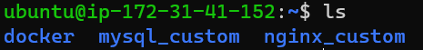

- [Docker](#docker)
  - [1. 도커를 왜 쓰냐](#1-도커를-왜-쓰냐)
  - [2. 도커 실습](#2-도커-실습)
    - [1. 설치](#1-설치)
    - [2. 이미지 파일을 생성하고 이미지파일로 컨테이너를 실행하기.](#2-이미지-파일을-생성하고-이미지파일로-컨테이너를-실행하기)
  - [3. 테스트환경 구축](#3-테스트환경-구축)
    - [1. 클라우드 플랫폼 : 클라우드 환경의 리눅스 서버에서 진행](#1-클라우드-플랫폼--클라우드-환경의-리눅스-서버에서-진행)
    - [2. 클라우드 서버에 도커로 개발환경 구성하기](#2-클라우드-서버에-도커로-개발환경-구성하기)
    - [3. CI와 도커 레지스트리를 이용한 테스트 배포](#3-ci와-도커-레지스트리를-이용한-테스트-배포)
    - [4. 도커 레지스트리 구축하기](#4-도커-레지스트리-구축하기)
  - [4. 네트워크](#4-네트워크)
    - [1. 네트워크의 종류](#1-네트워크의-종류)
  - [Docker-compose](#docker-compose)

# Docker

## 1. 도커를 왜 쓰냐

마이크로 서비스 아키텍처로 서비스 운영 중일 때

이를 테스트하려면 동일한 환경의 테스트 서버가 있어야 하는데 서버가 여러개면 인프라를 관리하기 힘들다.

이때 도커를 사용하면 한대의 물리적인 서버에서 여러 마이크로서비스를 관리할 수 있게 해준다.


그림에서 각 마이크로서비스를 감싸고 있는 사각형은 하나의 물리적인 서버를 의미한다.

그림과 같이 3개의 마이크로 서비스를 운영중이라면 3개의 서버를 구동하고 있고 서비스를 테스트하기 위한 환경도 3개의 서버로 구성해야 한다. 이렇게 되면 점점 유지, 보수할 인프라가 늘어나 힘들어진다.

그래서 도커를 적용하면 한대의 서버로 모든 마이크로 서비스를 관리할 수 있게 된다.

또한 언어가 달라도 상관없다.

이것을 가능하게 하는 것이 커널 기술인 Cgroup, Namespace이다.

1. Cgroup

    Control Group의 약자로 시스템의 CPU 시간, 시스템 메모리, 네트워크 대역폭과 같은 자원을 제한하고 격리할 수 있는 커널 기능이다.

2. Namespace

    시스템 리소스를 해당 프로세스에만 해당되는 자원처럼 보이도록 하고, 다른 프로세스와 격리시키는 가상화 기능이다.

Cgroup 기능으로 각 기능 별 자원을 격리하고 Namespace 기능을 통해 이들이 분리되어 보이도록 한다.

이 두 커널 기술이 도커 컨테이너의 핵심이다. 위의 기술을 통해 물리적인 가상화를 쓰지 않아도 인프라 운영을 하는데 있어 더 좋은 성능을 보장한다. 


---------------------------

## 2. 도커 실습

### 1. 설치

설치 전 컴퓨터에 가상화 옵션이 켜져 있는지 확인한다.

아래의 도커 공식 홈페이지에서 다운로드한다.

> https://www.docker.com/products/docker-desktop

다운로드 후 CMD 창에서 아래의 명령어를 통해 설치가 잘 됐는지 확인

```
docker --version
```

### 2. 이미지 파일을 생성하고 이미지파일로 컨테이너를 실행하기.

도커를 실행하기 위해 필요한 컨테이너의 기초이다.

현재 도커 이미지를 확인해보기 위해 아래의 명령어를 입력한다.

```
docker images
```

1. 이미지 가져오기

    이미지가 없다면 아무것도 뜨지 않을 것이다. 이제 이미지를 다운로드해보자.

    ```
    docker pull [도커 이미지 이름]

    docker pull nginx
    ```

    pull 명령어를 이용하 nginx 이미지 파일을 Docker hub에서 가져오겠다는 명령어이다. nginx는 웹서버 도커 이미지이다.

    그리고 다시 도커 이미지를 확인해보자

    

    이미지를 잘 다운로드 받았다.

    이제 이미지를 컨테이너화 해서 도커를 실행해본다.

    ```
    docker run --name nginx -p 8000:80 -d nginx
    ```

    - --name [이름]: 이름으로 컨테이너 이름 지정
    - -p [host port : container port] : 호스트 포트에 컨테이너 포트를 포워딩.
    - -d : detached mode, 백그라운드에서 실행
    - 마지막은 실행시킬 도커 이미지의 이름이다.

    실행이 됐다면 확인해보자.

    ```
    docker ps
    ```

    현재 실행중인 컨테이너의 목록을 볼 수 있다.

    

    잘 실행되고 있다. 웹 서버를 구동하였으니 서버에 접속해보자. 

    웹브라우저 주소창에 접속한다

    > http://localhost:8000

    

    접속에 이상이 없다. 순식간에 서버를 가동시켰다.


2. 이미지 만들기

    자 이제 이미지를 직접 만들어보자

    이미지 파일을 직접 수정할 수 없지만 컨테이너의 파일은 수정할 수 있다.

    nginx 파일을 수정하여 문구를 변경해보자!

    컨테이너 내부 셸로 접속하여 index.html 파일을 수정해보자.

    ```
    docker exec -it nginx /bin/bash
    ```

    - i : 이 옵션을 사용해야 셸에서 입력이 가능.
    - t : 리눅스 셸로 표시하는 기능

    컨테이너에 접속하였다면 수정하고픈 파일을 찾아야한다.

    ```
    find / -name index.html
    ```

    

    파일 위치를 알아냈다. 이 파일을 컨테이너 -> PC로 옮겨 수정을 해보자.

    그전에 접속한 컨테이너에서 나가자

    ```
    exit
    ``` 

    아래의 명령어를 이용하여 컨테이너 내에 있는 파일을 PC로 복사한다.

    ```
    docker cp nginx:/usr/share/nginx/html/index.html index.html
    ```

    현재 터미널의 경로로 가보면 파일이 복사되어 있을 것이다. 편집기를 통해 수정한다.

    수정 후 다시 컨테이너로 복사한다.

    ```
    docker cp index.html nginx:/usr/share/nginx/html/index.html
    ```

    수정된 파일을 반영한 이미지파일로 만들어준다.

    ```
    docker commit nginx mynginx
    ```

    - 현재 컨테이너 이름인 nginx를 내가 수정한 파일이 반영된 이미지파일 mynginx로 새로 만들었다.

    이미지를 다시 조회해보면 새로운 이미지가 생성되었을 것이다.

    

    이제 우리가 만든 새로운 이미지로 컨테이너를 실행해본다.

    우선 현재 실행 중인 컨테이너를 삭제해야 한다. 삭제는 stop -> rm 순서로 해야한다. 실행중인 컨테이너는 삭제할 수 없기 때문이다.

    ```
    docker stop nginx

    docker rm nginx
    ```

    이제 우리가 새로 만든 이미지를 실행해보자.

    ```
    docker run --name nginx -p 8000:80 -d mynginx
    ```

    웹브라우저에서 접속해보면 우리가 수정한 파일이 적용된 페이지를 확인할 수 있다.

    

    이렇게 스냅샷 형태로 이미지를 만들 수 있으며 다른 방법도 있다. 바로 도커파일을 이용하는 것이다.

3. Dockerfile

    파일 명을 `Dockerfile` 로 해서 파일을 생성한다. 그리고 아래의 소스를 입력한다.

    ```
    FROM nginx
    COPY index.html /usr/share/nginx/html/
    ``` 

    - nginx 이미지를 불러오는데 컨테이너 경로 `/usr/sharr/nginx/html/`에 우리가 가지고 있는 index.html을 복사하여 이미지파일로 만든다.

    도커파일을 이용하여 이미지를 만드는 명령어를 실행해본다.

    ```
    docker build -t mynginx2 .
    ```

    이때 도커파일에서 작성한 index.html 이 명령어를 실행하는 디렉토리에 존재해야한다. 

    도커파일로 생성한 이미지로 컨테이너를 실행해본다.

    ```
    docker run --name custom1 -p 8002:80 -d mynginx2
    ``` 

    호스트 포트를 8002로 설정하였으니 주의하여 접속해본다.

    > http://localhost:8002

    8000(nginx)과 8002(mynginx2)가 다른 문구를 띄우는 것을 확인할 수 있다.

    실습을 완료했으니 필요없는 이미지를 지워보자.

    ```
    docker rmi [이미지 이름]
    ```

    이미지를 삭제하기 전에 해당 이미지로 실행중인 컨테이너를 삭제해주어야한다.

----------------------

## 3. 테스트환경 구축

### 1. 클라우드 플랫폼 : 클라우드 환경의 리눅스 서버에서 진행

1. 구글 클라우드 플랫폼에 가입한다.

    > https://cloud.google.com/

2. 좌측의 Computing -> VM instance -> Create Instance 선택

3. Region은 서울로 설정 후 기본 OS가 리눅스임을 확인한다. 다른 옵션은 기본옵션으로 둔다.

    

4. Firmware 부분에 allow http를 체크한다.

    

    이는 로컬 PC에서 클라우드 웹 서비스에 접속하기 위해 HTTP 트래픽을 허용한다(80번 포트를 허용).

5. Create!

    

    인스턴스가 만들어졌다.
    
    AWS EC2도 동일하게 진행하면 된다. 추후 업로드 하겠음.

6. 이제 VM 인스턴스 리눅스에 접속해본다. 

    SSH를 통해 접속한다. 

    Connect 속성에 SSH 옆 작은 화살표를 눌러 Open in Web brower 를 통해 웹 브라우저에서 터미널창을 실행한다.

    

7. 접속이 됐다면 클라우드의 VM 환경에도 도커를 설치해준다.

    의존 라이브러리 설치
    ```
    sudo apt install -y apt-transport-https ca-certificates curl gnupg2 software-properties-common
    ```

    리포지토리 관련 부분 설치
    ```
    curl -fsSL https://download.docker.com/linux/debian/gpg | sudo apt-key add
    ```
    
    패키지 매니저에 도커 리포지토리 추가
    ```
    sudo add-apt-repository "deb [arch=amd64] https://download.docker.com/linux/debian $(lsb_release -cs) stable"
    ```

    패키지 매니저 업데이트
    ```
    sudo apt update -y
    ```

    >만약 업데이트 오류가 발생한다면 위의 도커 리포지토리를 제대로 확인해야한다.
    >
    >sudo vi /etc/apt/source.list
    >
    >위의 파일에서 잘 못 입력한 리포지토리 주소는 지우고 제대로 다시 추가해준다.

    도커를 설치한다.
    ```
    sudo apt install -y docker-ce=18.06.3~ce~3-0~debian

    또는

    sudo apt install docker.io
    ```

    도커가 설치 됐는지 확인한다.
    ```
    docker --version
    ```

    

    설치가 잘 됐따!

    일반계정에서 도커를 사용할 수 있도록 권한 부여
    ```
    sudo usermod -aG docker $USER
    ```

    이후 계정을 로그아웃 한 뒤 다시 로그인해야한다!
    ```
    logout
    ```
    
    이후 다시 접속
    
    

### 2. 클라우드 서버에 도커로 개발환경 구성하기

개발환경은 MySQL, Spring boot로 구성하며 컨테이너를 사용하여 각각의 레이어 실행.

1. MySQL 컨테이너 실행하기

    도커 허브에 해당 제품의 오피셜 이미지가 존재한다. 이것을 받는게 좋음.

    > https://hub.docker.com/

    ```
    docker run --name db -e MYSQL_ROOT_PASSWORD=1234 -p 3306:3306 -d mysql:tag
    docker exec -it db bash
    mysql -u root -p
    ```

    - MYSQL_ROOT_PASSWORD : 비밀번호를 설정
    - 맨 뒤의 mysql:[tag] : 해당 이미지의 버전을 의미한다.

2. SpringBoot 컨테이너 실행하기

    이것을 컨테이너에서 실행하기 위해서는 프로젝트 소스파일을 빌드하여 `jar`로 만들고 이것을 이미지화 해야한다.

    예제 소스를 받아서 진행해본다
    ```
    git clone https://github.com/ceo-nomadlab/docker.git
    ```

    받은 디렉토리로 들어가서 도커파일을 생성한다.
    ```
    FROM openjdk:8-jdk-alpine
    ADD /target/docker-0.0.1-SNAPSHOT.jar app.jar
    ENTRYPOINT ["java", "-Djava.security.egd=file:/dev/./urandom", "-Dspring.profiles.active=dev", "-jar", "/app.jar"]
    ```

    - FROM : 해당 이미지의 베이스가 되는 이미지이다. 컨테이너 파일시스템은 계층화되어있다.

        

        도커 이미지는 각각의 이미지를 서로 Layer 시키는 구조이다.

        베이스 이미지를 아래에 read Only(Image 라고 적힌 것)로 마운트 시키고, 프로세스로 쓰는 파일시스템을 read write로 마운트 시킨다.

        여기서는 좌측 그림에서 보면 openjdk:8이 아래의 Image1로 들어가고 jar파일이 위의 read write로 배치될 것이다.
    
    - ADD : 해당 경로에 있는 jar을 read write로써 베이스 이미지 위에 추가하는 것이다. 

    이제 빌드를 해보자.
    ```
    docker build -t springboot .
    ```

    잘 빌드 됐다면 실행해보자
    ```
    docker run --name app1 -d -p 80:8080 springboot
    ```

    아래의 명령어를 통해 컨테이너 로그를 본다.
    ```
    docker logs app1
    ```

    스프링 부트 로고가 나온다. 잘 실행됐다는 의미이다.

    이제 로컬PC에서 접속이 되는지 확인해본다. VM 인스턴스 대시보드에서 외부IP를 확인하고 해당 호스트로 접속해본다.

    

### 3. CI와 도커 레지스트리를 이용한 테스트 배포

도커 이미지를 서비스 운영 서버에 배포하는 방법은 **도커 레지스트리**를 이용하는 것이다.

도커 레지스트리는 특정 서버에 설치해서 운영 가능하지만 도커허브, 클라우드, CI/CD 서비스에서 자체제공하는 도커 레지스트리를 쓰는게 낫다.

1. 대표적인 도커 레지스트리인 도커 허브에 접속하여 레포지토리를 만든다.

    > https://hub.docker.com/

    가입 후 public으로 레포지토리를 하나 생성한다.

    이름은 custom-nginx로 설정했다.

2. 해당 로컬에 배포해보자

    터미널에서 도커허브 로그인을 한다.
    ```
    docker login
    ```

    로그인 되면 도커 허브 사이트에서 부여한 도커 레지스트리에 도커 이미지를 저장할 수 있다.
    ```
    docker tag mynginx2 dogyun/custom-nginx:mynginx2
    ```

    위의 명령어를 실행하면 도커 레지스트리에 업로드할 수 있는 이미지파일이 하나 생성된다.

    이제 업로드해보자
    ```
    docker push dogyun/custom-nginx:mynginx2
    ```

    푸쉬할 때 반드시 태그를 명시해주어야 한다.

    

    도커허브에 접속하여 레포지토리를 확인해보면 업로드 된 걸 확인할 수 있다.


### 4. 도커 레지스트리 구축하기

배포를 하기 위해서는 도커 레지스트리가 있어야 하며 CI는 여기서 수정된 이미지를 가져와 배포한다. 

`배포 과정 : 도커파일 작성 -> 테스트 환경에서 이미지로 만들어 배포`

위의 작업을 자동화 할 CI서버를 구성한다. 또한 여기에는 도커 레지스트리가 추가될 것이다.

1. 클라우드 VM 환경에서 **도커 레지스트리 컨테이너**를 생성한다.
    ```
    docker pull registry
    docker run -d -p 5000:5000 --restart=always --name registry registry
    ```

    이제 이 컨테이너가 도커허브와 같은 역할을 할 것이다.

2. 아무 도커 이미지를 다운받아 도커 레지스트리 컨테이너에 태깅한다.
    ```
    docker pull ubuntu
    ```

    도커 이미지를 태깅한다.
    ```
    docker image tag ubuntu localhost:5000/ubuntu
    ```

    태깅한 이미지를 도커 레지스트리 컨테이너에 푸쉬한다.
    ```
    docker push localhost:5000/ubuntu
    ```

3. 로컬PC에서 클라우드에 있는 도커 레지스트리를 다운받아 본다.

    우선 클라우드에서 방화벽 규칙을 설정한다. 

    새로운 방화벽 규칙을 생성하여 아래와 같이 설정한다.

    

    ```
    docker pull 34.64.172.102:5000/ubuntu
    ```

    로컬 PC에 클라우드에서 생성한 이미지를 다운로드 받았다.

    >만약 위의 명령어 실행 시 오류가 발생한다면 로컬PC에서 클라우드서버의 포트설정을 해야한다.
    >
    > Docker Icon -> Setting -> Docker Engine -> insecure-registries 부분에 ["34.64.172.102:5000"] 추가

    아래의 절차가 최종 배포 프로세스가 될 것이다. 

    1. 레지스트리를 사용하여 CI서버에서 새로운 소스의 도커 이미지 빌드 
    2. 레지스트리에 Push
    3. 테스트 서버에서 최신의 이미지 Pull
    4. 받은 이미지로 컨테이너 실행

도커 레지스트리에 여러 버전의 이미지를 태그하여 올려두면 **롤백**이 필요할 때 유용할 수 있다.

또한 테스트 할 때도 유용하다. 옛날 버전으로 테스트 하는 사람과 최신버전으로 테스트하는 사람이 동시에 테스트서버에서 테스트해볼 수 없지만 도커 레지스트리에 올라가있는 여러 버전의 이미지를 가볍게 pull하여 자신의 로컬 PC에서 컨테이너로 테스트환경을 구현하여 손쉽게 진행할 수 있다.

## 4. 네트워크

### 1. 네트워크의 종류

- 브릿지 모드 : 도커 네트워크의 default값

    ```
    ip addr show docker0
    ```

    위의 명령어는 도커가 설치된 리눅스에서 네트워크 인터페이스가 어떻게 설정되어 있는지 보는 것이다. 

    

    `3: docker0` 부분이 도커가 점유하고 있는 네트워크 인터페이스이다.

    docker0은 컨테이너들이 통신하기 위한 가상 Linux bridge이다. 

    이것은 bridge 네트워크 안에서 컨테이너끼리 독립적으로 통신 + 외부 호스트 서버랑도 통신 가능.

    

    - 도커 네트워크 환경

    호스트 서버가 컨테이너들과 통신하기 위해 Linux bridge가 지원한다.

    ```
    docker network inspect bridge
    ```

    - 더 자세한 도커 bridge에 대한 정보를 확인할 수 있다. 

    이제 **컨테이너에 IP가 어떻게 할당**되는지 알아보자.

    실습을 위해 ifconfig 명령어가 추가된 nginx, mysql 이미지 파일을 생성한다.

    디렉토리를 나누고 각 디렉토리 내에 Dockerfile을 생성한다.

    

    ```
    FROM nginx:latest
    RUN apt-get update
    RUN apt-get install -y net-tools
    RUN apt-get install -y iputils-ping
    ```
    - nginx_custom 디렉토리 내 Dockerfile

    ```
    FROM mysql:5.7.8
    RUN apt-get update
    RUN apt-get install -y net-tools
    RUN apt-get install -y iputils-ping
    ```
    - mysql_custom 디렉토리 내 Dockerfile

    이미지 파일을 생성한다.
    ```
    docker build -t mysql-custom .
    docker build -t nginx-custom .
    ```
    - 도커파일이 저장된 디렉토리 위치에서 각각 실행한다.

    이미지를 실행한다.
    ```
    docker run --name db -e MYSQL_ROOT_PASSWORD=111111 -p 3306:3306 -d mysql-custom
    
    docker run --name nginx -p 80:80 -d nginx-custom
    ```
    - 만약 실행되지 않는다면 이미 존재하는 이름의 컨테이너가 존재한다는 것이다. 삭제해주자

        > docker rm -f [컨테이너 이름]

    우선 각 컨테이너의 ip주소를 확인한다.
    ```
    docker exec db ifconfig eth0
    
    docker exec nginx ifconfig eth0
    ```

     
    

    - db의 ip주소 : **172.17.0.4**
    - nginx의 ip주소 : **172.17.0.2**

    ip를 이용한 통신을 확인해보자.

    ```
    ping -c 3 172.17.0.4
    ```

    이는 bridge 네트워크를 통해 **호스트 - 컨테이너 네트워크 통신**을 확인한 것이다.

    **컨테이너간 통신**은 어떻게 할까?

    ```
    docker exec -it nginx ping -c 3 172.17.0.4
    ```

    ip를 이용해 통신이 가능하다.

    하지만 ip는 컨테이너를 재시작하면 변할 수 있는 유동적인 값이다.

    ip를 고정하는 옵션이 있긴 하나 유동적으로 할당되는 ip를 사용하는 인프라에서는 불편할 것이다.

    따라서 ip를 사용하지 않고 컨테이너와 통신하는 방법이 필요하다.

    1. Link 옵션 사용하기

        ```
        docker run --name nginx1 --link nginx:nginx -d nginx-custom
        ```

        - 컨테이너 실행 시 --link 옵션을 통해 nginx라는 컨테이너와 이름을 통해 통신하게 된다. 


        통신을 확인해보자
        ```
        docker exec nginx1 ping -c 3 nginx
        ```

        그리고 link 옵션을 주면 컨테이너의 hosts 파일에 해당 DNS를 추가한다. 이를 확인해보자
        ```
        docker exec nginx1 cat /etc/hosts
        ```
        
        

    2. 사용자 정의 Bridge를 네트워크로 사용

        브릿지 네트워크 생성
        ```
        docker network create my_bridge
        ```

        네트워크 목록 보기
        ```
        docker network ls
        ```

        생성된 네트워크 내에 컨테이너를 실행해보자.
        ```
        docker run --name nginx2 --network my-bridge -d nginx-custom
        docker run --name nginx3 --network my-bridge -d nginx-custom
        ``` 

        nginx2 -> nginx3 통신을 확인한다.
        ```
        docker exec nginx2 ping -c 3 nginx3
        ```

        편하게 한 네트워크 내의 컨테이너 실행하기!!

        container모드로 실행한다.
        ```
        docker run --name [컨테이너 이름] --net=container:[같은 네트워크 내에 실행하고 싶은 컨테이너 이름] -d [이미지 이름]
        ```

## Docker-compose

docker-compose? 컨테이너를 실행하는 구문을 docker-compose.yml 파일에 모두 모아놓고 실행하는 것.

이는 인프라를 코드로 관리할 수 있게 해준다.

앞에서 만들었던 MySQL, SpringBoot 컨테이너를 docker-compose.yml파일로 만들어보자.

우선 docker-compose를 설치한다.
```
sudo curl -L "https://github.com/docker/compose/releases/download/1.25.0/docker-compose-$(uname -s)-$(uname -m)" -o /usr/local/bin/docker-compose
```

일반유저 사용 권한을 허용한다.
```
sudo chmod +x /usr/local/bin/docker-compose
```

그리고 docker-compose.yml 파일을 생성하여 아래의 소스를 입력한다.

```yml
version: '3.3'
services:
    app1:
        image: springboot
        ports:
            - 8080:8080
        container_name: app1

    mysql:
        image: mysql:5.7
        environment:
            - MYSQL_ROOT_PASSWORD=1234
            - TZ=Asia/Seoul
        ports:
            - 3306:3306
        container_name: mysql
```

이때까지 잘 따라왔다면 소스코드 내용에 대한 이해는 충분할 것이다.

docker-compose 파일을 통해 컨테이너들을 실행한다.

```
docker-compose up -d
```

이는 이미지가 업데이트가 되면 컨테이너는 자동 삭제되고 다시 생성된다. 

아주 좋다.

네트워크 옵션을 추가해보자.

```yml
version: '3.3'
services:
    app1:
        image: springboot
        ports:
            - 8080:8080
        container_name: app1
        networks:
            - mynetwork

    mysql:
        image: mysql:5.7
        environment:
            - MYSQL_ROOT_PASSWORD=1234
            - TZ=Asia/Seoul
        ports:
            - 3306:3306
        container_name: mysql
        networks:
            - mynetwork
networks:
    mynetwork:
```

해당 코드를 추가해주면 도커 컴포즈가 알아서 브릿지를 생성하고 해당 네트워크에서 컨테이너를 실행한다.


