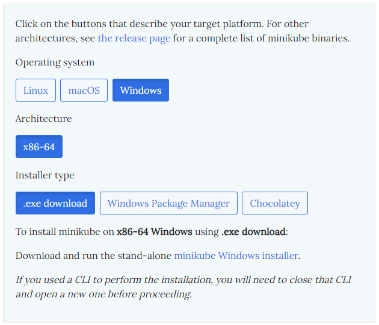

로컬에서 쿠버네티스를 사용하기 위해 **minikube**를 사용할 것이다.

AWS에서 제공하는 AKS(Azure Kubernetes Service)도 있지만 유료이고 개인적인 공부를 할 것이므로 로컬에서 실습을 할 것이다.

# 1. minikube 시작하기

## 0. 설치 전 확인

- CPU 2 core 이상
- RAM 2GB 이상
- SSD 20GB 이상
- 인터넷 연결
- 도커, 가상머신 등의 가상환경

## 1. 설치d

> https://minikube.sigs.k8s.io/docs/start/

사이트 접속



위와 같이 설정 한 뒤 `minikube Windows installer`를 눌러 설치를 한다.

콘솔창에 입력하여 설치를 확인한다
```sh
$ minikube
```

- 나는 vscode의 터미널 환경에서 진행하고 있는데 실행이 안 된다면 프로그램을 재시작한다.
- 한국어로 친절하게 설명이 나온다.


## 2. 클러스터 시작

나는 도커 드라이브로 클러스터를 시작할 것이다.

> https://minikube.sigs.k8s.io/docs/drivers/docker/

```sh
$ minikube start --driver=docker
```

명령어를 입력하여 도커에서 첫 클러스터를 실행한다.

그러면 도커에 `gcr.io/k8s-minikube/kicbase` 이미지파일이 컨테이너로 실행될 것이다.

```sh
$ minikube config set driver docker
```
- 명령어를 통해 도커 드라이브로의 실행을 디폴트값으로 설정한다.


## 3. 클러스터 보기

```sh
$ kubectl get po -A
```

기본적으로 실행 중인 클러스터들을 확인할 수 있다.

etcd, apiserver 등등 앞에서 배운 쿠버네티스 아키텍쳐의 구성요소들을 확인할 수 있다.

## 4. 배포

샘플을 만들고 포트 8080으로 배포해본다.

```sh
$ kubectl create deployment hello-minikube --image=k8s.gcr.io/echoserver:1.4
```

다시 클러스터 목록을 보면 새로 생긴 것을 확인할 수 있다.

```sh
$ kubectl expose deployment hello-minikube --type=NodePort --port=8080
```
- 클러스터의 포트 8080으로 받는다.

```sh
$ kubectl get services hello-minikube
```

```sh
$ kubectl port-forward service/hello-minikube 7080:8080
```
- 만약 8080 포트를 사용 중이라 실행 실패한다면 포트번호를 바꿔 포워딩한다.