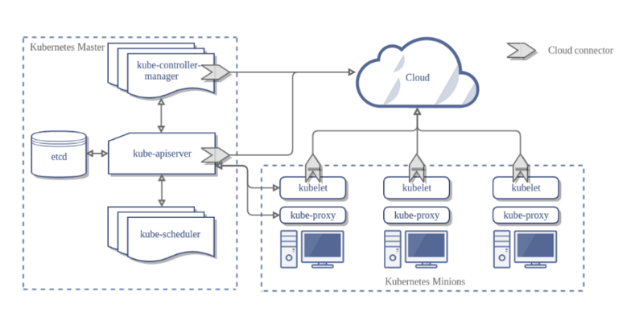

- [0. 개요](#0-개요)
- [1. 쿠버네티스 아키텍처](#1-쿠버네티스-아키텍처)
- [2. 쿠버네티스 설치](#2-쿠버네티스-설치)
- [3. 쿠버네티스 오브젝트](#3-쿠버네티스-오브젝트)
	- [1) 네임스페이스](#1-네임스페이스)
	- [2) 파드(Pod)](#2-파드pod)
	- [3) 디플로이먼트(Deployment)](#3-디플로이먼트deployment)
	- [4) 서비스(Service)](#4-서비스service)
	- [5) 인그레스(Ingress)](#5-인그레스ingress)
	- [6) 스토리지(Storage)](#6-스토리지storage)
	- [7) 노드](#7-노드)
- [4. 네트워크](#4-네트워크)
	- [1) Container Network Interfaces(CNI)](#1-container-network-interfacescni)
	- [2) 컨테이너 간 네트워킹](#2-컨테이너-간-네트워킹)
	- [3) 파드 간 네트워킹](#3-파드-간-네트워킹)
- [5. 스케줄링](#5-스케줄링)
- [6. 구성 파일](#6-구성-파일)
	- [1) 일반적인 구성 팅](#1-일반적인-구성-팅)
	- [2) 구성 파일 이용 이점](#2-구성-파일-이용-이점)
- [7. 컨피그맵(ConfigMap), 시크릿(Secret)](#7-컨피그맵configmap-시크릿secret)
	- [1) 컨피그맵](#1-컨피그맵)
	- [2) 시크릿](#2-시크릿)
---------------------------------
# 0. 개요

도커의 단점 : 트래픽이 증가하여 호스트 서버의 규모를 확대, 이후 다시 축소할 때의 해결책 부족.

이 단점은 **도커 오케스트레이션**으로 해결가능하다.

도커 오케스트레이션을 쓰면 여러 개의 호스트를 단일 호스트처럼 사용 가능.


오케스트레이션을 쓰면 다음과 같은 일을 해결할 수 있다.
- 컨테이너 프로비저닝 및 배포
- 컨테이너의 중복성 및 가용성
- 컨테이너 인프라 확장 또는 제거로 호스트 인프라 전체에 애플리케이션 로드를 균등하게 분산
- 호스트에 리소스가 부족하거나 호스트가 죽은 경우 한 호스트에서 다른 호스트로 컨테이너 이동
- 컨테이너 간 리소스 할당
- 내부 컨테이너에서 실행되는 서비스의 외부 노출
- 컨테이너 간 서비스 검색 **로드밸런싱**
- 컨테이너 및 호스트의 상태 **모니터링**
- 애플리케이션을 실행하는 컨테이너와 관련하여 애플리케이션 구성

이런 도커 오케스트레이션 툴 중 가장 범용적인 것이 **쿠버네티스**이다.

# 1. 쿠버네티스 아키텍처

쿠버네티스 : 여러 컨테이너를 하나의 물리적인 서버에 배치하고 관리



- 클러스터 : 노드를 하나로 묶음
- 컨트롤 플레인 영역 : 클러스터를 관리함
    - 컨트롤 플레인 컴포넌트 : 클러스터 이벤트 감지, 클러스터에 관한 결정을 내림. 클러스터 내 아무 머신에서 동작 가능함.
    - kube-apiserver : 쿠버네티스 모든 컴포넌트의 통신 담당.
    - etcd : 클러스터 데이터를 담는 쿠버네티스 뒷단 저장소. Key-Value저장소.
    - kube-scheduler : 새로 생성된 파드 감지. 실행할 노드를 선택하는 컴포넌트
    - kube-controller-manager : 컨트롤러를 구동하는 컴포넌트. 
    - cloud-controller-manager : 클라우드 제공 사업자와 상호작용하는 컨트롤러를 작동시킴. 
    - node-component : 동작중인 파드를 유지시키고 쿠버네티스 런타임 환경 제공. 모든 노드 상에 동작함.
    - kubelet : 클러스터의 각 노드에서 실행되는 에이전트.
    - kube-proxy : 클러스터의 각 노드에서 실행되는 네트워크 프록시, 쿠버네티스 서비스 개념의 구현부. 노드 네트워크 규칙 유지 관리하여 이 규칙으로 내부 네트워크 세션이나 클러스터 바깥에서 파드로 네트워크 통신 할 수 있음.
    - container-runtime : 컨테이너 실행을 담당하는 SW
- 노드 영역 : 노드 관리함

# 2. 쿠버네티스 설치

- 클라우드에서 실습하려고 하니까 kubeadm은 최소 2개의 CPU와 1700MB의 램 용량이 필요했는데 AWS의 프리티어에서 제공하는 EC2는 1개의 CPU와 1G의 램용량에서 제한이 걸려 더 이상 클라우드에서 실습이 불가능해졌다.
- 앞으로의 실습은 VM machine 가상환경에서 할 것이다.
- 가상환경 설정에 프로세서를 2개 이상으로 설정하자.


**쿠버네티스 공식 문서**
> https://kubernetes.io/ko/


- 쿠버네티스를 포함한 도커 오케스트레이션 설치
    ```sh
    sudo apt update

    sudo apt install apt-transport-https ca-certificates curl gnupg2 software-properties-common

    curl -fsSL https://download.docker.com/linux/ubuntu/gpg | sudo apt-key add

    sudo add-apt-repository "deb [arch=amd64] https://download.docker.com/linux/ubuntu $(lsb_release -cs) stable"

    sudo apt update

    sudo apt-get install -y docker-ce docker-ce-cli containerd.io

    sudo usermod -aG docker $USER

    curl -s https://packages.cloud.google.com/apt/doc/apt-key.gpg | sudo apt-key add -

    cat <<EOF | sudo tee /etc/apt/sources.list.d/kubernetes.list
    deb https://apt.kubernetes.io/ kubernetes-xenial main
    EOF

    sudo apt update
    sudo apt install -y kubelet kubeadm kubectl
    sudo apt-mark hold kubelet kubeadm kubectl
    sudo swapoff -a

    kubeadm config images pull

    sudo kubeadm init
    ```
    - 실행 후 나오는 토큰을 잘 복사해둔다.

    ```
    kubeadm join <Kubernetes API Server:PORT> --token <2. Token 값>    --discovery-token-ca-cert-hash sha256:<3. Hash 값>
    ```
    - kubeadm join 10.0.2.15:6443 --token weh3sj.hg0fy9w6r8txm1fc \
        --discovery-token-ca-cert-hash sha256:001aea354ed9bf372a3f1d17ce949fc2fba53cf42d26e6acf9d0d2c7daf6c2ef 

    토큰은 24시간동안 유효하며 이 시간이 지나면 재발급해야한다
    ```sh
    kubeadm create token
    ```

    IPv6를 통한 쿠버네티스 배포 옵션
    ```sh
    mkdir -p $HOME/.kube

    sudo cp -i /etc/kubernetes/admin.conf $HOME/.kube/config

    sudo chown $(id -u):$(id -g) $HOME/.kube/config
    ```

- 파드 네트워크 Add-On 설치

    파드 배포와 통신을 위한 네트워크 설정을 해준다.

    Weave Net 애드온 설치! (여러 종류가 있음)

    각 클러스터마다 Network Add-On 하나씩만 설치 가능

    ```
    kubectl apply -f "https://cloud.weave.works/k8s/net?k8s-version=$(kubectl version | base64 | tr -d '\n')"

    kubectl taint nodes --all node-role.kubernetes.io/master-

    kubectl apply -f "https://cloud.weave.works/k8s/scope.yaml?k8s-service-type=NodePort" 
    ```


# 3. 쿠버네티스 오브젝트

쿠버네티스 요소는 yaml 파일로 생성, 관리 가능하다.


- yaml 파일 구조

## 1) 네임스페이스

네임스페이스 : 하나의 쿠버네티스를 논리적으로 분리해줌.

네임스페이스 조회
```sh
$ kubectl get namespace
```

기본적으로 모든 작업은 네임스페이스 default에 할당됨.

네임스페이스 yaml 파일 생성

`namespace.yaml`
```yaml
apiVersion: v1
kind: Namespace
metadata:
  name: team1
```

파일이 있는 디렉토리로 이동 후 구성파일을 실행해본다.

```sh
$ kubectl apply -f namespace.yaml
```

해당 네임스페이스를 이용하여 파드를 만들어본다.
```sh
$ kubectl run nginx --image=nginx --namespace=team1
```

파드 확인
```sh
$ kubectl get pod -n team1
```

```sh
$ kubectl get pod
```
이 명령어로 default 네임스페이스의 파드를 확인할 수 있다.

현재는 아무것도 없을 것이다. 왜냐하면 team1 네임스페이스에서 파드를 만들었기 때문임.

이렇게 네임스페이스를 통해 작업 내용이 논리적으로 분리됨.

## 2) 파드(Pod)

파드는 쿠버네티스 구성요소 중 가장 작은 단위의 객체.

쿠버네티스에서의 컨테이너 느낌.

파드 내에 여러 도커컨테이너가 존재할 수 있다.


- 파드 내부
    - IP주소와 포트 공유.
	- localhost를 통해 서로를 찾음.

- 공유 컨텍스트
    - 네임스페이스
    - 컨트롤그룹 (cgroup)
    - 그외 격리요소

- 생명주기
	- Pending : 파드가 쿠버네티스 시스템에 의해 승인 됨. 하지만 파드를 위한 컨테이너 이미지 생성이 안 된 상태. 
	- Running : 파드가 노드에 결합됐고 모든 컨테이너 생성이 완료된 상태. 적어도 하나의 컨테이너가 실행 중
	- Succeeded : 파드의 모든 컨테이너가 생성된 상태
	- Failed : 파드의 모든 컨테이너가 종료됐고, 하나 이상의 컨테이너가 실패로 종료된 상태
	- Unknown : 파드의 상태를 얻을 수 없는 상태. 보통은 파드-호스트 통신 오류에 의함.

- 파드 생성

	`pod.yaml` 파일 생성 후 소스 입력
	```yaml
	apiVersion: v1
	kind: Pod
	metadata:
	  name: nodejs-app
	spec:
	  containers:
	  - name: nodejs-app
	    image: uphiller/nodejs-hello-world
		ports:
		- containerPort: 3000
	```

	파드 생성 확인
	```sh
	$ kubectl apply -f pod.yaml
	$ kubectl get pod
	```

	처음 파드 확인을 하면 `ContainerCreating` 상태일 것이다. 이미지를 다운받고 정상적으로 실행될 때 까지 기다렸다가 다시 확인하면 `Running` 상태로 실행 될 것이다.

	이제 파드에 `mysql` 컨테이너를 넣어 같이 실행해보자.

	그 전에 앞에서 실행했던 파드는 삭제한다.
	```sh
	$ kubectl delete pod nodejs-app
	```

	`pod.yaml` 파일 수정
	```yaml
	apiVersion: v1
	kind: Pod
	metadata:
		name: nodejs-app
	spec:
		containers:
		- name: nodejs-app
			image: uphiller/nodejs-hello-world
			ports:
			- containerPort: 3000
		- name: mysql-app
			image: mysql
			env:
			- name: MYSQL_ROOT_PASSWORD
			value: "1234"
			ports:
			- containerPort: 3306	
	```

	그리고 다시 파드 생성
	```sh
	$ kubectl apply -f pod.yaml
	$ kubectl get pod
	```

	하면 `READY`에 `0/2`로 2개의 컨테이너가 생성되고 있음을 확인할 수 있다.

	파드의 상세 내용을 보려면 아래의 명령어 입력
	```sh
	$ kubectl describe pod nodejs-app
	```

이렇게 파드에 여러 개의 컨테이너를 배치시켜 서비스에 필요한 부분들을 그룹핑하여 파드 내 컨테이너끼리는 자유롭게 통신하고 다른 파드들과는 노출된 포트로만 통신하게 하여 마이크로서비스를 만드는 것과 유사한 형태를 만들 수 있음.

일반적으로 사용자가 파드를 직접 만들지 않음.

대부분 **디플로이먼트**와 같은 컨트롤러를 사용함.

이는 복제하여 다중 관리할 수 있게 해준다.


## 3) 디플로이먼트(Deployment)

파드와 레플리카셋에 대한 선언과 업데이트를 제공하는 상위 개념의 컨트롤러

파드만으로 서비스 운영 시 트래픽이 몰릴 때 복제를 해야하는데 불가능함.

이 복제와 복제 조절을 가능하게 해 주는게 디플로이먼트.

- 디플로이먼트 생성

	`nodejs.yaml`
	```yaml
	apiVersion: apps/v1
	kind: Deployment
	metadata:
	name: nodejs-app
	labels:
		app: nodejs-app
	spec:
	replicas: 1
	selector:
		matchLabels:
		app: nodejs-app
	template:
		metadata:
		labels:
			app: nodejs-app
		spec:
		containers:
		- name: nodejs-app
			image: uphiller/nodejs-hello-world
			ports:
			- containerPort: 3000
	```

	가장 중요한 부분이 `replicas` 복제 숫자이다.

	실행해본다.
	```sh
	$ kubectl apply -f nodejs.yaml
	$ kubectl get pod
	$ kubectl get replicaset
	$ kubectl get deployment
	```

	

	모두 생성됐다.

	레플리카셋은 파드의 복제를 관리.

	디플로이먼트는 복제를 포함한 파드를 생성, 관리함.

	여기서 `nodejs.yaml`의 `replicas`의 숫자를 늘려 다시 실행해보자.

	파드 목록을 다시 확인하면 늘린 숫자만큼의 복제본이 실행되고 있을 것이다.

	또한 이미지도 수정하여 업데이트할 수 있다.

	`nodejs.yaml` 파일의 `image` 부분의 태그를 수정하여 다시 실행해본다.

	업데이트 확인을 위해 롤아웃 명령어를 사용해본다.
	```sh
	$ kubectl rollout status deployment.apps/nodejs-app
	```
	
	그리고 파드 목록을 확인해보면 아이디값이 바뀐 것을 확인할 수 있다.

	이전의 컨테이너들은 모두 삭제되고 새로 생성된 것이다.

	디플로이먼트 히스토리를 확인하려면 아래 명령어를 사용한다.
	```sh
	$ kubectl rollout history deployment.apps/nodejs-app
	```

	`CHANGE-CAUSE`가 <none>인 이유는 CHANGE-CAUSE를 지정하는 명령어를 실행하지 않았기 때문이다.
	```sh
	$ kubectl annotate deployment.apps/nodejs-app kubernetes.io/change-cause="image updated to latest"
	```

	명령어 실행 후 다시 히스토리를 확인해보면 지정됐다.
	
	디플로이먼트 롤백을 할 수도 있다. 변경한 디플로이먼트가 안정적일지 않을 때의 경우...

	롤백을 실습하기위해 먼저 존재하지 않는 이미지로 업데이트한다.

	`nodejs.yaml`에서 이미지의 TAG를 1.73 등 없는 버전으로 설정하고 저장한다.

	그 후 디플로이먼트실행
	```sh
	$ kubectl apply -f nodejs.yaml

	$ kubectl rollout status deployment.apps/nodejs-app
	```

	실행하면 없는 이미지파일이라 업데이트가 진행되지 않는다. `Ctrl + C`를 눌러 중단 후 레플리케이션을 확인한다.

	```sh
	$ kubectl get rs
	$ kubectl get pod
	```

	확인하면 `ImagePullBackOff` 또는 `ErrImagePull` 메세지를 확인할 수 있다. 이는 이미지를 불러올 때 문제가 생긴 것이다.

	```sh
	$ kubectl describe deployment
	```
	로 문제를 확인할 수 있다.

	이제 롤백을 해본다.
	```sh
	$ kubectl rollout undo deployment
	$ kubectl rollout status deployment.apps/nodejs-app
	```

	이전 버전으로 롤백된 것을 확인할 수 있다.


## 4) 서비스(Service)

서비스는 파드에 접근할 수 있도록 정책을 정의하는 것.

- 파드 간 통신을 위한 엔드포인트 정의.
- 파드가 외부에 노출될 수 있게 함.

**주요 옵션**
- ClusterIP : 서비스가 클러스터-내부 IP에 노출되도록 한다.
- NodePort : 고정 포트. 각 노드의 IP에 서비스가 노출되도록 한다. <NodeIP>:<NodePort> 를 요청하여 클러스터 외부에서 NodePort 서비스에 접속가능.
- LoadBalancer : 클라우드 공급자의 로드밸런서를 사용하여 서비스가 외부에 노출되게 함. 외부 로드 밸런서가 라우팅되는 NodePort와 ClusterIP 서비스가 자동으로 생성된다.
- ExternalName : 값과 함께 CNAME 레코드 리턴하여, 서비스를 externalName 필드의 콘텐츠(foo.bar.example.com 등)에 맵핑한다.

위의 옵션은 서비스가 파드를 노출해 줄 수 있는 방식들이다.

쿠버네티스만으로 실행할 수 있는 ClusterIP, NodePort를 실습해본다.

이전 예제와 같이 nodejs-app 디플로이먼트 생성 후 노출시킨다.
```sh
$ kubectl apply -f nodejs.yaml
$ kubectl expose deploy nodejs-app
```

명령어에 아무 옵션 없이 하면 ClusterIP 옵션이 디폴트값이다.

```sh
$ kubectl get svc nodejs-app
```

실행하면 내부 클러스터 IP를 확인할 수 있고 외부 IP는 <none>이다.

그리고 `PORT(S)`를 보면 3000/TCP로 확인할 수 있다.

외부에 노출되게 하기 위해서는 `NodePort` 옵션을 사용한다.

그 전에 이전에 생성했던 서비스를 삭제한다.
```sh
$ kubectl delete svc nodejs-app
```

그리고 옵션을 부여하여 다시 실행한다.

```sh
$ kubectl expose deploy nodejs-app --type=NodePort
$ kubectl get svc nodejs-app
```

`PORT(S)`를 보면 30653 포트로 해당 파드와 통신할 수 있게 됐다.

지금까지 실행한 명령어를 설정 파일로 다시 정의해보면

`service.yaml`
```yaml
apiVersion: v1
kind: Service
metadata:
  name: nodejs-app
spec:
  selector:
    app: nodejs-app
  ports:
  - protocol: TCP
    port: 30163
    targetPort: 3000
  type: NodePort
```

로 볼 수 있고 명령어를 통해 실행이 가능하다.
```sh
$ kubectl apply -f service.yaml
```


## 5) 인그레스(Ingress)

인그레스는 클러스터 외부에서 클러스터 내부 서비스로 접속하도록 해 준다.

구성 요소 : 인그레스 리소스, 인그레스 컨트롤러

인그레스는 GCE용, NGINX용 두개가 있다.

NGINX용으로 테스트해본다.

먼저 NGINX용 인그레스 컨트롤러를 설치한다.

```sh
$ kubectl apply -f https://raw.githubusercontent.com/kubernetes/ingress-nginx/nginx-0.29.0/deploy/static/mandatory.yaml
```
```
$ kubectl apply -f https://raw.githubusercontent.com/kubernetes/ingress-nginx/controller-v0.47.0/deploy/static/provider/cloud/deploy.yaml
```
그리고 컨트롤러를 외부에 노출한다.
```sh
$ kubectl expose deploy nginx-ingress-controller --type=NodePort -n ingress-nginx service/nginx-ingress-controller exposed

$ kubectl get svc -n ingress-nginx
```

---------안 됨 ㅡㅡ --------------------


80번 포트는 30114포트로 443포트는 31341포트로 외부에 노출되었다.

해당 포트로 브라우저 접속해본다.

> localhost:30114

이까지 됐다면 인그레스 설치에 성공한 것이다. 404 에러가 뜨는 것은 실제 서비스를 파드에 연결하지 않아서 그런것이다.


## 6) 스토리지(Storage)

스토리지는 볼륨이다.

- 파드 내의 컨테이너끼리 파일 공유할 때.

- DB 환경과 DB파일 분리

볼륨을 사용하는 방식

- PV (Persistent Volume) : 볼륨 리소스 그 자체.
- PVC (Persistent Volume Claim) : 사용자가 볼륨에 요청하는 방식을 정의한 것.

mysql 컨테이너를 가지고 있는 파드를 만들어 실습해본다.

1. 실질적인 볼륨인 PV를 생성한다.

	`mysql-pv.yaml`
	```yaml
	apiVersion: v1
	kind: PersistentVolume
	metadata:
		name: mysql-pv-volume
		labels:
			type: local
	spec:
		storageClassName: manual
		capacity:
			storage: 20Gi
		accessModes:
			- ReadWriteOnce
		hostPath:
			path: "./data"
	```

	```sh
	$ kubectl apply -f mysql-pv.yaml
	```


2. 파드가 PV에게 요청하는 것을 정의한 PVC를 생성한다.

	`mysql-pvc.yaml`
	```yaml
	apiVersion: v1
	kind: PersistentVolumeClaim
	metadata:
		name: mysql-pv-claim
	spec:
		storageClassName: manual
		accessModes:
			- ReadWriteOnce
		resources:
			requests:
			storage: 20Gi
	```

	```sh
	$ kubectl apply -f mysql-pv.yaml
	```

3. 생성이 잘 됐는지 확인.

	```sh
	$ kubectl get pv
	$ kubectl get pvc
	```

	`STATUS`가 Bound 상태여야 한다.

	Pending 상태이면 생성이 안 된 것임.

4. deployment를 이용하여 볼륨을 포함한 mysql 파드를 생성한다.

	`mysql-deployment.yaml`
	```
	apiVersion: apps/v1
	kind: Deployment
	metadata:
	name: mysql
	spec:
	selector:
		matchLabels:
		app: mysql
	strategy:
		type: Recreate
	template:
		metadata:
		labels:
			app: mysql
		spec:
		containers:
		- name: mysql
			image: mysql:5.6
			env:
			- name: MYSQL_ROOT_PASSWORD
			value: "1234"
			ports:
			- containerPort: 3306
			name: mysql
			volumeMounts:
			- mountPath: ./
				name: mysql-persistent-storage
		volumes:
			- name: mysql-persistent-storage
			persistentVolumeClaim:
				claimName: mysql-pv-claim
	```

	```sh
	$ kubectl apply -f mysql-deployment.yaml
	```

5. 파드 생성을 확인한다.
   
   ```sh
   $ kubectl get pods -l app=mysql
   ```

6. MySQL 명령을 실행해서 작동 확인.

	```sh
	$ kubectl run -it --rm --image=mysql:5.6 --restart=Never mysql-client -- mysql -h mysql -ppassword
	```


## 7) 노드

노드는 파드를 실행할 수 있는 물리적인 공간이다.

스케줄러에 의해 파드가 노드에 할당됨.

노드 상의 서비스는 Container Runtime, kubelet, kube-proxy가 있다.


0. 노드의 상태

   - Ready : 노드가 파드를 수용 가능상태 True, 아니면 False, 시간동안 노드 응답을 받지 못할 때 Unknown
   - NotReady : 노드 상태 불량
   - MemoryPressure : 메모리 부족하면 True, 아니면 False
   - PIDPressure : 노드 상에 많은 프로세스가 있는 경우 True, 아니면 False
   - DiskPressure : 디스크 용량 부족하면 True, 아니면 False
   - NetworkUnavailable : 네트워크 불량 시 True, 아니면 False

1. 노드 설치

	로컬에서 쿠버네티스를 사용하기 위해 **minikube**를 설치.

	```sh
	$ kubectl get nodes
	```

	로 클러스터와 연결된 노드를 확인할 수 있다.


# 4. 네트워크


- 쿠버네티스 네트워크 구성도

쿠버네티스의 네트워크 구성을 한 번 알아보자.

여러 대의 노드, 그 노드는 여러 개의 파드로 구성.

이들의 통신은 어떻게 할까!

세 부분으로 나눠 분석한다.

    1. Container Network Interfaces(CNI)
    2. 컨테어나 간의 네트워킹
    3. 파드 간의 네트워킹


## 1) Container Network Interfaces(CNI)

파드 간, 노드 간 통신을 위한 네트워크 인터페이스이다.

여러 CNI 플러그인이 있지만 이 중 **Calico** 플러그인 사용

> 참조 : https://github.com/containernetworking/cni

**Calico Plugin 설치**

```sh
$ kubectl apply -f https://docs.projectcalico.org/v3.11/manifests/calico.yaml
```

작성 시점 기준(21/07/01) 버전 3.19까지 나와있다.

- 플러그인 설치를 하지 않을 경우에..

	간단하게 파드를 생성하고 상태를 확인해보자.

	`nodejs-app.yaml`
	```yaml
	apiVersion: v1
	kind: Pod
	metadata:
	name: nodejs-app
	spec:
	containers:
	- name: nodejs-app
		image: uphiller/nodejs-hello-world
		ports:
		- containerPort: 3000
	```

	```sh
	$ kubectl apply -f nodejs-app.yaml
	$ kubectl get pod
	$ kubectl describe pod
	```

	Pending 상태라면 노드 상태를 확인한다.
	```sh
	$ kubectl get node
	$ kubectl describe node [node name]
	```

	더 깊이 살펴보기 위해 노드 에이전트인 kubelet 상태를 살펴본다.

	```sh
	$ sudo systemctl status kubelet
	```
	
	로그를 살펴보면 `Unable to update cni config` 부분이 정의되지 않아서 오류가 발생한다.

	이는 CNI 플러그인 설치를 해야 해결가능함.

	CNI를 설치해줘야 쿠버네티스 노드가 정상작동한다.


## 2) 컨테이너 간 네트워킹

동일한 파드 내 컨테이너 간 네트워킹

파드가 호스트 역할. 

도커 운영 시 컨테이끼리 통신하는 방식과 같음.


- 두 개의 노드를 갖는 단순한 구조의 클러스터

구성 파일을 사용하여 해당 파드를 생성해본다.

`nodejs-app-multi.yaml`
```yaml
apiVersion: v1
kind: Pod
metadata:
  name: nodejs-app
  labels:
    name: nodejs-app
spec:
  containers:
  - name: nodejs-app
    image: heroku/nodejs-hello-world
    ports:
      - containerPort: 3000
  - name: mysql-app
    image: mysql
    env:
    - name: MYSQL_ROOT_PASSWORD
      value: "1234"
    ports:
      - containerPort: 3306
```

생성 후 확인한다.
```sh
$ kubectl apply -f nodejs-app-multi.yaml
$ kubectl get -f nodejs-app-multi.yaml
$ kubectl describe -f nodejs-app-multi.yaml
```

두 개의 컨테이너를 확인할 수 있다. (Container ID 확인)

하나의 파드 내에 두 컨테이너의 통신을 확인해본다.

```sh
$ kubectl exec nodejs-app -c mysql-app -- ping nodejs-app
```

ping이 먹히지 않는다면 다음과 같이 한다.

(먹히지 않는 이유는 해당 컨테이너에 ping 패키지가 없어서 그럼.)
```sh
$ kubectl exec -it nodejs-app -c mysql-app bin/bash

$ apt update
$ apt install inetutils-ping
```

다시 해보면 통신 확인 가능.

이는 mysql-app 컨테이너 내에서 확인할 수 있다.
```sh
$ kubectl exec nodejs-app -c mysql-app -- cat etc/hosts
```

이렇게 파드 내 컨테이너 간 통신을 확인해봤다.


## 3) 파드 간 네트워킹

위의 파드 내 컨테이너 간 통신은 특별케이스임

쿠버네티스는 보통 파드를 복제해서 운영하기 때문에 1파드-싱글컨테이너가 국룰임.


- 네트워크 구성에 따른 IP 할당

그림과 같이 모든 파드는 고유한 IP를 할당받음

이를 확인해보자.

우선 앞의 구성파일 (한 파드 내에 두 개의 컨테이너)을 수정하여 1파드 1컨테이너로 한다.

`mysql-app.yaml`
```yaml
apiVersion: v1
kind: Pod
metadata:
  name: nodejs-app
spec:
  containers:
  - name: nodejs-app
    image: uphiller/nodejs-hello-world
    ports:
    - containerPort: 3000
```

`nodejs-app.yaml`
```yaml
apiVersion: v1
kind: Pod
metadata:
  name: mysql-app
  labels:
    name: mysql-app
spec:
  containers:
  - name: mysql-app
    image: mysql
    env:
    - name: MYSQL_ROOT_PASSWORD
      value: "1234"
    ports:
    - containerPort: 3306
```

두 개를 한 디렉토리에 넣으면 편리하게 실행 가능
```
pods
  ㄴ mysql-app.yaml
  ㄴ nodejs-app.yaml
```

```sh
$ kubectl apply -f pods/
$ kubectl get -f pods/
```

그리고 파드 정보를 조회해 각자의 IP가 할당된 것을 확인해본다.

```sh
$ kubectl describe -f pods/
```
- 172.17.0.12와 172.17.0.9로 할당됨.
  

# 5. 스케줄링


# 6. 구성 파일
## 1) 일반적인 구성 팅
## 2) 구성 파일 이용 이점

# 7. 컨피그맵(ConfigMap), 시크릿(Secret)
## 1) 컨피그맵
## 2) 시크릿
