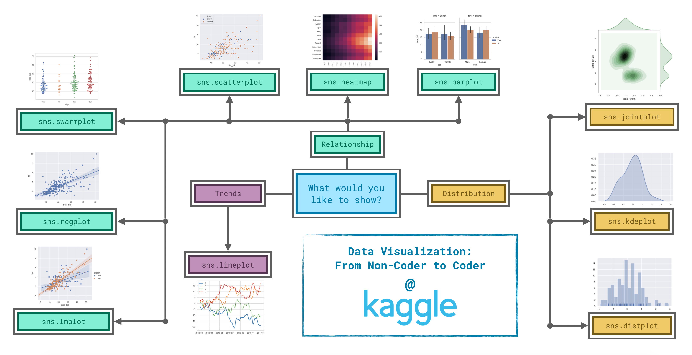

# seaborn Library

데이터 시각화 해주는 라이브러리

matplotlib보다 좀 더 사용하기 쉽다.

그래프 값을 표현하는 거(그래프 그리기)는 seaborn을 사용하고,

그 외에 그래프의 축 이름이나 그래프의 크기 등은 여전히 matplotlib을 사용한다.

즉 두개를 섞어서 사용함.

## Matplotlib 주로 쓰는 것

```py
plt.figure(figsize=(14, 6))
plt.title("title")
plt.xlabel("label")
```

## 종류





### 트랜드(Trends)

변화하는 패턴을 나타내고 싶을 때

1. lineplot()

    선 그래프 그리기.

    - data=table or table[column]
    - label="column"

### 관계(Relationship)

변수들의 관계를 알고 싶을 때

1. countplot()

    x축 속성 별 카운트를 y축으로 한 막대 그래프를 그린다.

    y축은 카운트 값으로 고정되어 있다

    - hue='Col' : hue 추가 시 2개의 데이터의 카운터를 나타낼 수 있다.

2. barplot()
    
    막대 그래프 그리기.

    다른 그룹들 간에 값, 양 비교할 때

    - x=table.index
    - y=table[column]

3. heatmap()

    격자 그래프 그리기.

    데이터 테이블의 값들의 수치를 색깔패턴으로 한눈에 파악할 수 있다.

    - data=table
    - annot=True : 각 셀의 값 표시하기.


4. scatterplot()

    분산 그래프 그리기. 

    두 개의 연속적인 값들의 관계를 보여준다. 색깔까지 표시하면 세 개의 값들 관계 표시 가능.

    - x=table['column']
    - y=table['column']
    - hue=table['column'] : 찍혀진 점들에 색깔로 또 다른 정보를 표시할 수 있다.

5. regplot()

    회귀 직선(regression line)을 그리기.

    분산 그래프에서 더 쉽게 두 변수 사이의 관계를 선형식으로 알 수 있다.

    - x=table['column']
    - y=talbe['column']

6. lmplot()

    여러 데이터를 표시하고 데이터마다 회귀 직선 그리기.

    여러 개의 선형 회귀 직선을 그릴 때 유용하다.

    - x="column"
    - y="column"
    - hue="column"
    - data=table


7. swarmplot()

    x축 속성 별 데이터의 분포를 볼 수 있다.

    연속적인 값과 이산값의 관계를 알 수 있다. x축 속성이 이산값.

    - x=table['column']
    - y=table['column']


8. factorplot(col1, col2, hue=col3, data=dataFrame, size=num, aspect=num)

### 분포(Distribution)

변수에서 볼 수 있는 가능한 값과 그 확률을 확인하기 위해 쓴다.

1. distplot()

    히스토그램 그리기.

    단일값에 대한 분포 확률을 보여준다.

    - a=table['column']
    - kde=False : Kernel density Estimate 


2. kdeplot()

    채워진 곡선 그래프를 그릴 수 있따.

    커널 밀도 측정으로 x축 데이터 별 밀도함수를 그린다.

    분포의 스무스한 추정치 그래프를 그려준다.

    - data=table['column']
    - shade=True


3. jointplot()

    2차원 밀도 그래프를 그린다.

    등고선 느낌

    - x=table['column']
    - y=table['column']
    - kind='kde'

4. plt.legend()

    여러 개의 그래프를 플랏시킨 후 색깔로 구분한 그래프를 그린다.

